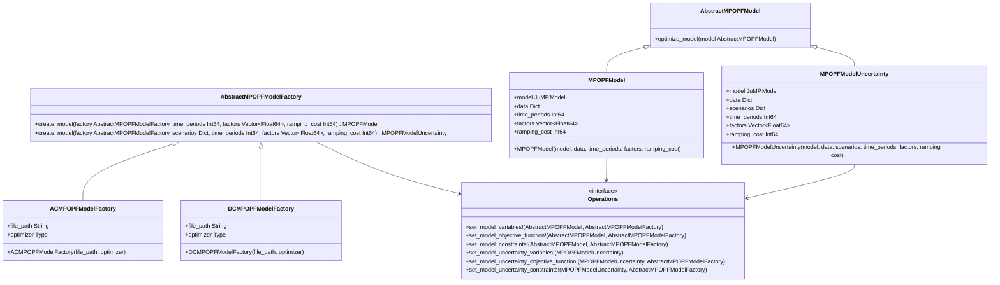

# Multiperiod Optimal Power Flow (MPOPF)

## Utilities

- [MatPower Graph Display](https://matpower.app/)
- [MatPower Description of Case Format](https://matpower.org/docs/ref/matpower5.0/caseformat.html)
<!-- - [Markdown Admonitions](https://documenter.juliadocs.org/stable/showcase/#Admonitions) -->

## Introduction

Welcome to the MPOPF project.
This Julia package provides tools for analyzing and optimizing power flow in electrical networks over multiple time periods.

> **ℹ️ Note:**  
> For a more in-depth description of the project please visit our [Documentation](https://maxim-ciobanu.github.io/OPF/)

## Installation
Note: This project uses Julia version 1.10.3
Clone the repository (example uses ssh)
```sh
$ git clone git@github.com:Maxim-Ciobanu/OPF.git
```
Install the MPOPF package:
First run Julia in the terminal
```sh
$ julia
```
Then enter the Package manager by pressing `]`
```julia
julia> ]
```
Add the package. Note: `./OPF` is the directory we cloned, adjust if needed.
```julia
(@v1.10) pkg> add ./OPF
```
This will install the package and all dependencies. After it is done press `backspace` to exit the package manager.
Then we can run MPOPF code using the package in any `.jl` file
<br>
<br>
To test that everything works:
Create a new file `test.jl` anywhere and add the following code:
```julia
using MPOPF

# Please replace the case file path with the path to the case file on your machine
scenarios, correlation_matrix, covariance_matrix = generate_correlated_scenarios("./Cases/case14.m", 1, 0.15)
display(correlation_matrix)

```
If you see a correlation matrix then it works.
Note: A license is needed to use Gurobi.

## Features

- [X] Support for AC and DC power flow models
- [X] Multi-period optimization
- [ ] Uncertainty modeling
- [X] Linearization techniques
- [ ] Local search optimization
- [X] Feasibility checking

# Design Diagram (Needs Updating)


