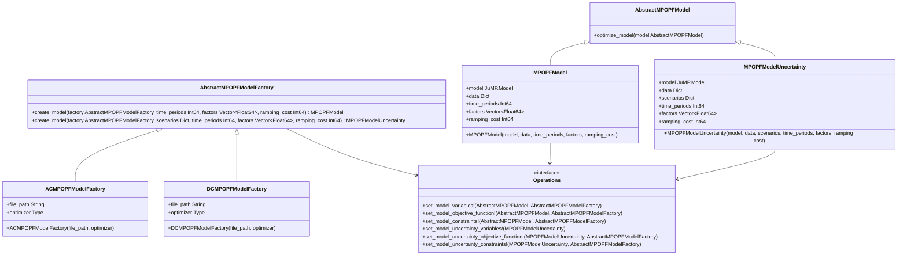

!!! danger

    Still Working on this :(

# Class UML Diagram

```mermaid
classDiagram
         AbstractMPOPFModelFactory <|-- ACMPOPFModelFactory
         AbstractMPOPFModelFactory <|-- DCMPOPFModelFactory
   
         AbstractMPOPFModel <|-- MPOPFModel
         AbstractMPOPFModel <|-- MPOPFModelUncertainty
   
         AbstractMPOPFModelFactory : +create_model(factory AbstractMPOPFModelFactory, time_periods Int64, factors Vector~Float64~, ramping_cost Int64) MPOPFModel
         AbstractMPOPFModelFactory : +create_model(factory AbstractMPOPFModelFactory, scenarios Dict, time_periods Int64, factors Vector~Float64~, ramping_cost Int64) MPOPFModelUncertainty
         AbstractMPOPFModel : +optimize_model(model AbstractMPOPFModel)
   
         ACMPOPFModelFactory : +file_path String
         ACMPOPFModelFactory : +optimizer Type
         ACMPOPFModelFactory : +ACMPOPFModelFactory(file_path, optimizer)
   
         DCMPOPFModelFactory : +file_path String
         DCMPOPFModelFactory : +optimizer Type
         DCMPOPFModelFactory : +DCMPOPFModelFactory(file_path, optimizer)
   
         MPOPFModel : +model JuMP.Model
         MPOPFModel : +data Dict
         MPOPFModel : +time_periods Int64
         MPOPFModel : +factors Vector~Float64~
         MPOPFModel : +ramping_cost Int64
         MPOPFModel : +MPOPFModel(model, data, time_periods, factors, ramping_cost)
   
         MPOPFModelUncertainty : +model JuMP.Model
         MPOPFModelUncertainty : +data Dict
         MPOPFModelUncertainty : +scenarios Dict
         MPOPFModelUncertainty : +time_periods Int64
         MPOPFModelUncertainty : +factors Vector~Float64~
         MPOPFModelUncertainty : +ramping_cost Int64
         MPOPFModelUncertainty : +MPOPFModelUncertainty(model, data, scenarios, time_periods, factors, ramping cost)
   
         %% Operations
         class Operations {
           <<interface>>
           +set_model_variables!(AbstractMPOPFModel, AbstractMPOPFModelFactory)
           +set_model_objective_function!(AbstractMPOPFModel, AbstractMPOPFModelFactory)
           +set_model_constraints!(AbstractMPOPFModel, AbstractMPOPFModelFactory)
           +set_model_uncertainty_variables!(MPOPFModelUncertainty)
           +set_model_uncertainty_objective_function!(MPOPFModelUncertainty, AbstractMPOPFModelFactory)
           +set_model_uncertainty_constraints!(MPOPFModelUncertainty, AbstractMPOPFModelFactory)
         }
         AbstractMPOPFModelFactory --> Operations
         MPOPFModel --> Operations
         MPOPFModelUncertainty --> Operations
```